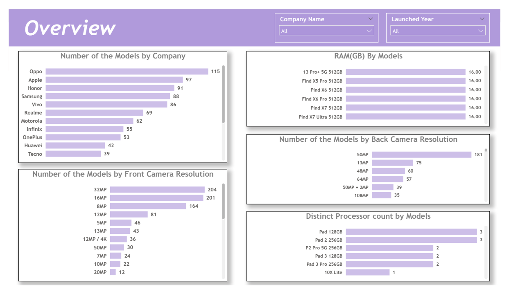
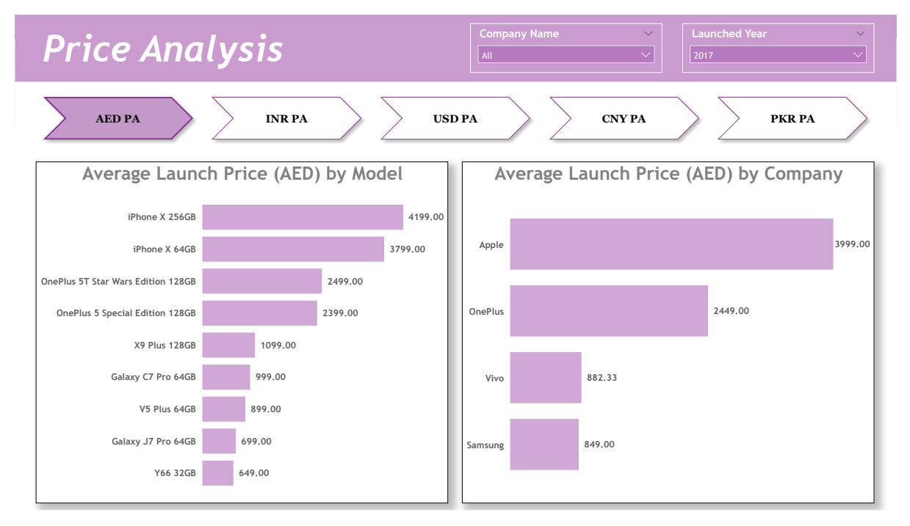
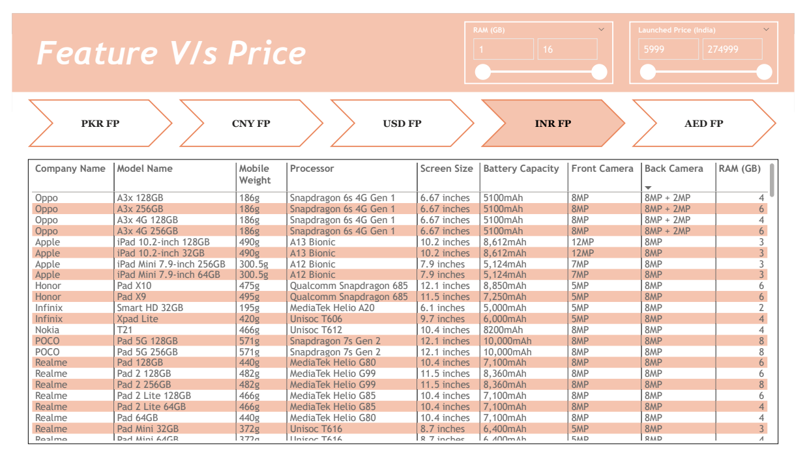
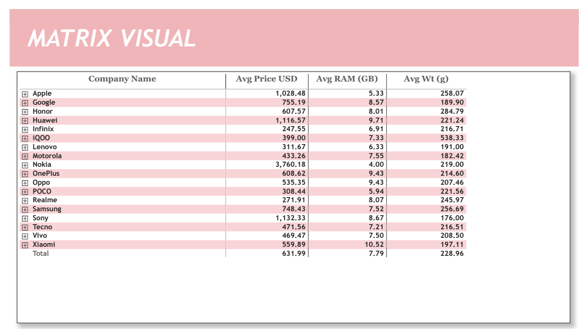

# Mobile Dataset Analysis
Power BI | SharePoint | SQL | DAX | Data Analytics

## Project Summary
End-to-end data analysis project focused on exploring mobile device specifications, pricing, and feature comparisons using a dataset stored in a SharePoint Folder and analyzed in Power BI.

The project evaluates mobile models across brands, regions, prices, and hardware features to support data-driven product comparison and market insights.

### Tools & Technologies
- Power BI Desktop & Power BI Service
- SharePoint Online (Cloud Data Source)
- Power Query (ETL & Data Transformation)
- DAX (CONCATENATE, LEN, LEFT, IF, SUMMARIZE, AVERAGE)
- SQL-style data validation & profiling

### Data Source
- Mobile dataset stored in SharePoint Folder
- Source file: Mobiles Dataset (2025).csv
- Includes brand, model, pricing (multiple regions), RAM, camera specs, processor, weight, and launch year

### Key Responsibilities
- Created and configured SharePoint site for data storage
- Connected SharePoint Folder to Power BI
- Cleaned and transformed data using Power Query
- Removed duplicates and corrected inconsistent values
- Converted regional prices (INR, PKR, CNY, AED) to USD
- Created conversion factor tables for currency normalization
- Built calculated columns and tables using DAX
- Designed multi-page interactive Power BI dashboards
- Implemented drill-through, bookmarks, and slicers
- Published reports to Power BI Service

### Key Metrics & Analysis
- Number of mobile models by company
- RAM, processor, camera, and battery comparison
- Average launch price by country and brand
- Feature vs price comparison across regions
- Model-level drill-through analysis
- Currency-normalized price comparison (USD)

### Business Insights
- Significant pricing variation observed across regions for the same mobile models
- Higher RAM and camera specifications are strongly associated with higher launch prices
- Certain brands consistently offer better feature-to-price value
- Drill-through analysis enables quick identification of models meeting specific feature criteria

### Outcome
Delivered a production-ready Power BI solution that enables interactive exploration of mobile device data, supports feature-based comparisons, and provides clear insights into pricing and product positioning.

### Skills Demonstrated
- Data Analysis & Visualization
- SharePoint Data Integration
- Data Cleaning & Transformation (ETL)
- DAX Calculations & Data Modeling
- Currency Conversion & Normalization
- Analytical Storytelling

## Report Screenshots (Power BI)

### Mobile Overview Dashboard

### Price Analysis Dashboard

### Feature vs Price Comparison Dashboard

### Brand-Level Matrix Summary

